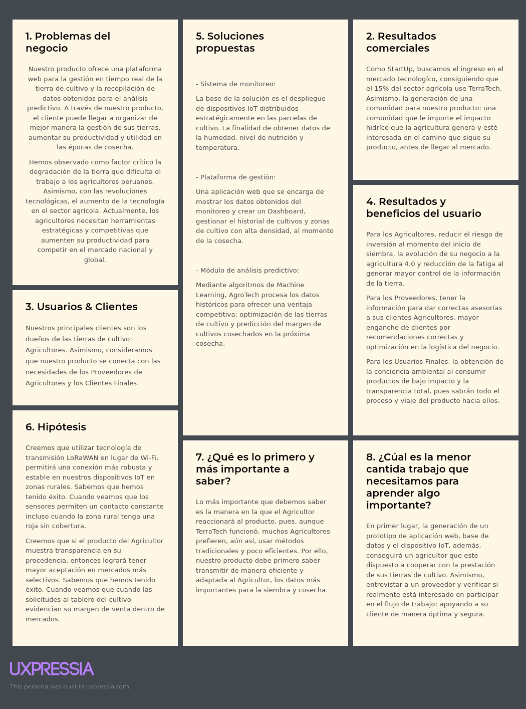

**Carrera**: Ingeniería de Software

**Periodo**: 2026-10

**Curso**: Aplicaciones Web

**NRC**: 10215

**Profesor**: Velasquez Nuñez, Angel Augusto

**Informe de Trabajo Final**

**Startup**: TerraTech

**Producto**: AgroTech

**Integrantes**:

Acuña de la Cruz, Luis Alfredo - u202417228

Aguilar Untiveros, Rodrigo Fabrizio - u202318309

Howard Robles, Guillermo Arturo - u202222275

Perez Encarnacion, Breithner Rodolfo - u202418577

Retuerto Rodríguez, Jorge Manuel - u202318612

**Marzo, 2026**

# Registro de Versiones del Informe

<table>

<tr>
<th colspan="3">Version</th>
<th colspan="3">Fecha</th>
<th colspan="10">Autores</th>
<th colspan="5">Descripción de Modificaciones</th>
<tr>

<td colspan="3">TB1</td>
<td colspan="3">00/00/00</td>
<td colspan="10">Acuña de la Cruz, Luis Alfredo    Aguilar Untiveros, Rodrigo Fabrizio    Howard Robles, Guillermo Arturo    Perez Encarnacion, Breithner Rodolfo    Retuerto Rodríguez, Jorge Manuel</td>
<td colspan="5"></td>

</tr>

</table>

# Project Report Collaboration Insights

A continuación, capturas del procesos, commits  y elaboración de nuestro proyecto en cada entrega.

**Entrega Nº1: TB1**

# Contenido

## Tabla de contenido

### [Capítulo I: Introducción](#capítulo-i-introducción)
- [1.1. Startup Profile](#11-startup-profile)
    - [1.1.1 Descripción de la Startup](#111-descripción-de-la-startup)
    - [1.1.2 Perfiles de integrantes del equipo](#112-perfiles-de-integrantes-del-equipo)
- [1.2 Solution Profile](#12-solution-profile)
    - [1.2.1 Antecedentes y problemática](#121-antecedentes-y-problemática)
    - [1.2.2 Lean UX Process](#122-lean-ux-process)
        - [1.2.2.1. Lean UX Problem Statements](#1221-lean-ux-problem-statements)
        - [1.2.2.2. Lean UX Assumptions](#1222-lean-ux-assumptions)
        - [1.2.2.3. Lean UX Hypothesis Statements](#1223-lean-ux-hypothesis-statements)
        - [1.2.2.4. Lean UX Canvas](#1224-lean-ux-canvas)
- [1.3. Segmentos objetivo](#13-segmentos-objetivo)

### [Capítulo II: Requirements Elicitation & Analysis](#capítulo-ii-requirements-elicitation--analysis)
- [2.1. Competidores](#21-competidores)
    - [2.1.1. Análisis competitivo](#211-análisis-competitivo)
    - [2.1.2. Estrategias y tácticas frente a competidores](#212-estrategias-y-tácticas-frente-a-competidores)
- [2.2. Entrevistas](#22-entrevistas)
    - [2.2.1. Diseño de entrevistas](#211-análisis-competitivo)
    - [2.2.2. Registro de entrevistas](#222-registro-de-entrevistas)
    - [2.2.3. Análisis de entrevistas](#223-análisis-de-entrevistas)
- [2.3. Needfinding](#23-needfinding)
    - [2.3.1. User Personas](#231-user-personas)
    - [2.3.2. User Task Matrix](#232-user-task-matrix)
    - [2.3.3. User Journey Mapping](#233-user-journey-mapping)
    - [2.3.4. Empathy Mapping](#234-empathy-mapping)
- [2.4. Big Picture Event Storming](#24-big-picture-event-storming)
- [2.5. Ubiquitous Language](#25-ubiquitous-language)

### [Capítulo III: Requirements Specification](#capítulo-iii-requirements-specification)
- [3.1. User Stories](#31-user-stories)
- [3.2. Impact Mapping](#32-impact-mapping)
- [3.3. Product Backlog](#33-product-backlog)

### [Capítulo IV: Product Design](#capítulo-iv-product-design)
- [4.1. Style Guidelines](#41-style-guidelines)
    - [4.1.1. General Style Guidelines](#411-general-style-guidelines)
    - [4.1.2. Web Style Guidelines](#412-web-style-guidelines)
- [4.2. Information Architecture](#42-information-architecture)
    - [4.2.1. Organization Systems](#421-organization-systems)
    - [4.2.2. Labeling Systems](#422-labeling-systems)
    - [4.2.3. SEO Tags and Meta Tags](#423-seo-tags-and-meta-tags)
    - [4.2.4. Searching Systems](#424-searching-systems)
    - [4.2.5. Navigation Systems](#425-navigation-systems)
- [4.3. Landing Page UI Design](#43-landing-page-ui-design)
    - [4.3.1. Landing Page Wireframe](#431-landing-page-wireframe)
    - [4.3.2. Landing Page Mock-up](#432-landing-page-mock-up)
- [4.4. Web Applications UX/UI Design](#44-web-applications-uxui-design)
    - [4.4.1. Web Applications Wireframes](#441-web-applications-wireframes)
    - [4.4.2. Web Applications Wireflow Diagrams](#442-web-applications-wireflow-diagrams)
    - [4.4.3. Web Applications Mock-ups](#443-web-applications-mock-ups)
    - [4.4.4. Web Applications User Flow Diagrams](#444-web-applications-user-flow-diagrams)
- [4.5. Web Applications Prototyping](#45-web-applications-prototyping)
- [4.6. Domain-Driven Software Architecture](#46-domain-driven-software-architecture)
    - [4.6.1. Design-Level Event Storming](#461-design-level-event-storming)
    - [4.6.2. Software Architecture Context Diagram](#462-software-architecture-context-diagram)
    - [4.6.3. Software Architecture Container Diagrams](#463-software-architecture-container-diagrams)
    - [4.6.4. Software Architecture Components Diagrams](#464-software-architecture-components-diagrams)
- [4.7. Software Object-Oriented Design](#47-software-object-oriented-design)
    - [4.7.1. Class Diagrams](#471-class-diagrams)
- [4.8. Database Design](#48-database-design)
    - [4.8.1. Database Diagram](#481-database-diagram)

### [Capítulo V: Product Implementation, Validation & Deployment](#capítulo-v-product-implementation-validation--deployment)
- [5.1. Software Configuration Management](#51-software-configuration-management)
    - [5.1.1. Software Development Environment Configuration](#511-software-development-environment-configuration)
    - [5.1.2. Source Code Management](#512-source-code-management)
    - [5.1.3. Source Code Style Guide & Conventions](#513-source-code-style-guide--conventions)
    - [5.1.4. Software Deployment Configuration](#514-software-deployment-configuration)
- [5.2. Landing Page, Services & Applications Implementation](#52-landing-page-services--applications-implementation)
    - [5.2.1. Sprint 1](#521-sprint-1)
        - [5.2.1.1. Sprint Planning 1](#5211-sprint-planning-1)
        - [5.2.1.2. Aspect_Leaders_and_Collaborators](#5212-aspect-leaders-and-collaborators)
        - [5.2.1.3. Sprint Backlog 1](#5213-sprint-backlog-1)
        - [5.2.1.4. Development Evidence for Sprint Review](#5214-development-evidence-for-sprint-review)
        - [5.2.1.5. Execution Evidence for Sprint Review](#5215-execution-evidence-for-sprint-review)
        - [5.2.1.6. Services Documentation Evidence for Sprint Review](#5216-services-documentation-evidence-for-sprint-review)
        - [5.2.1.7. Software Deployment Evidence for Sprint Review](#5217-software-deployment-evidence-for-sprint-review)
        - [5.2.1.8. Team Collaboration Insights during Sprint](#5218-team-collaboration-insights-during-sprint)

### [Conclusion](#conclusiones)

### [Recomendacion](#recomendaciones)

### [Bibliografía](#bibliografia)

### [Anexos](#anexo)

# Student Outcome

Student Outcome ABET: **ABET – EAC - Student Outcome 3**   Criterio: _Capacidad de comunicarse efectivamente con un rango de audiencias._

<table>

<tr>
<th colspan="3">Criterio específico</th>
<th colspan="3">Acciones realizadas</th>
<th colspan="10">Conclusiones</th>
</tr>

<tr>
<td colspan="3">Comunica oralmente sus ideas y/o resultados con objetividad a público de diferentes especialidades y niveles jerárquicos, en el marco del desarrollo de un proyecto en ingeniería.</td>
<td colspan="3">TB1: Retuerto Rodríguez, Jorge Manuel</td>
<td colspan="10">TB1: </td>
</tr>

<tr>
<td colspan="3">Comunica oralmente sus ideas y/o resultados con objetividad a público de diferentes especialidades y niveles jerárquicos, en el marco del desarrollo de un proyecto en ingeniería.</td>
<td colspan="3">TB1: Retuerto Rodríguez, Jorge Manuel</td>
<td colspan="10">TB1: </td>
</tr>

</table>

# Capítulo I: Introducción

## 1.1. Startup Profile

NovaTech es una startup dedicada a transformar la vida de nuestros clientes mediante soluciones tecnológicas, eficientes y escalables en distintos sectores. Actualmente, tras detectar los desafíos críticos en el sector agricola, hemos creado TerraTech : una solución web que conectará la tecnología con la tierra. Mediante sensores de humedad y nutrientes, ofrecemos un control total a los sembríos en tiempo real. Asimismo, la aplicación analizará los datos entregados para generar recomendaciones y obtención de las zonas más fertiles para asegurar la obtención de las mejores cosechas en el futuro.

**Misión:**

Buscamos el desarrollo de tecnológia innovadora y eficiente que transformen la calidad de trabajo en diversos sectores laborales, optimizando el uso de recursos y máximizando utilidades para mejorar la calidad de vida de nuestros clientes.

**Visión:**

Ser la líder en la integración tecnológica multisectorial, reconocida por soluciones efectivas sostenibles y de alta eficiencia a nivel internacional.

### 1.1.1 Descripción de la Startup

### 1.1.2 Perfiles de integrantes del equipo

<table>
<tr>
 <th colspan="4">Foto</th>
 <th colspan="6">Apellido y nombre</th>
 <th colspan="6">Carrera</th>
 <th colspan="8">Acerca de</th>
</tr>

<tr>
 <th colspan="4"></th>
 <th colspan="6">Acuña de la Cruz, Luis Alfredo</th>
 <th colspan="6">Ingeniería de Software</th>
 <th colspan="8">Mi nombre es Luis Alfredo Acuña de la Cruz (u202417228), tengo 19 años y estoy cursando el 5to ciclo de la carrera de Ingeniería de Software en la Universidad Peruana de Ciencias Aplicadas. Me apasiona el desarrollo de software, el aprendizaje continuo y la resolución de problemas mediante soluciones innovadoras y eficientes. Busco aplicar buenas prácticas y tecnologías modernas para crear sistemas robustos, escalables y de alta calidad en cada proyecto.</th>
</tr>

<tr>
 <th colspan="4"></th>
 <th colspan="6">Aguilar Untiveros, Rodrigo Fabrizio</th>
 <th colspan="6">Ingeniería de Software</th>
 <th colspan="8">Mi nombre es Rodrigo, estudiante de Ingeniería de Software comprometido con el aprendizaje de nuevas metodologías de desarrollo. Me motiva el análisis de retos técnicos para diseñar soluciones que sean tanto funcionales como innovadoras. Mi enfoque está orientado a la creación de herramientas digitales robustas, priorizando siempre la optimización de procesos y la implementación de estándares de calidad que permitan un crecimiento constante en cada desarrollo.</th>
</tr>

<tr>
 <th colspan="4"></th>
 <th colspan="6">Howard Robles, Guillermo Arturo</th>
 <th colspan="6">Ingenieria de Software</th>
 <th colspan="8">Mi nombre es Guillermo Arturo Howard Robles (u202222275) tengo 20 años, Soy estudiante de Ingeniería de Software, enfocado y en constante aprendizaje. Me apasiona investigar y analizar problemas para proponer soluciones innovadoras. Busco desarrollar software integral, aplicando las buenas prácticas y tecnologías modernas que aseguren eficiencia, escalabilidad, calidad y mejora continua en cada proyecto.</th>
</tr>

<tr>
 <th colspan="4"></th>
 <th colspan="6">Perez Encarnacion, Breithner Rodolfo</th>
 <th colspan="6">Ingeniería de Software</th>
 <th colspan="8">Mi nombre es Breithner Rodolfo Perez Encarnacion, tengo 19 años y soy estudiante de la carrera de Ingeniería de Software. Cuento con conocimientos y habilidades sólidas en el lenguaje C++ y en el diseño de modelos relacionales. Asimismo, poseo un manejo intermedio de bases de datos tanto SQL como NoSQL (MongoDB), incluyendo validación de reglas y pipelines de agregación. Me haré responsable del diseño del modelo relacional, la normalización de bases de datos y de asegurar la integridad técnica del proyecto junto a mi equipo.</th>
</tr>

<tr>
 <th colspan="4"></th>
 <th colspan="6">Retuerto Rodríguez, Jorge Manuel</th>
 <th colspan="6">Ingenieria de Software</th>
 <th colspan="8">Mi nombre es Jorge Manuel Retuerto Rodríguez, tengo 20 años y estoy cursando el 6to ciclo de la carrera de Ingeniería de Software en la Universidad Peruana de Ciencias Aplicadas. Mi conocimiento y habilidades de programación son intermedias en C++, C#, HTML y CSS. Sin embargo, básicas en Python y Java. Me haré responsable de la comunicación del grupo, planificación y desarrollo junto a mi equipo.</th>
</tr>

</table>

## 1.2 Solution Profile

TerraTech es una solución diseñada para el sector agricola que responde a las demandas del sector, aplicando soluciones mediante dispositivos IoT y análisis predictivo.

Nuestro objetivo es transformar la gestión tradicional de los campos en uno actualizado, integrado tegnológia en la tierra para aumentar la precisión de su fertilidad, bases de datos en tiempo real y proyecciones de rendimiento para maximizar la eficiencia y rentabilidad de los cultivos.

### 1.2.1 Antecedentes y problemática

Por un lado, la degradación de los suelos es uno de los principales desafíos críticos que la agricultura moderna enfrenta en nuestra región. El 45% de las tierras de cultivo en América del Sur ya presentan signos de deterioro (AgroPerú, 2025). Ante ello, surge la necesidad de implementar soluciones como TerraTech , que permitan el monitoreo de la calidad de tierra mediante dispositivos IoT, evitando la sobreexplotación y promoviendo la recuperación de tierra fértil.

Por otro lado, la agricultura 4.0 se basa en la utilización de tecnologías digitales dentro del sector, con la finalidad de obtener mejoras notables en la eficiencia, sostenibilidad y rentabilidad (CEPLAN, 2023). Por ello, con la finalidad de ofrecer una herramienta estratégica a los agricultores peruanos, TerraTech desarrolla soluciones competitivas de clase global, integrando IoT y análisis predictivo para transformar datos compilados en decisiones que aseguren la calidad en el futuro campo.

### 1.2.2 Lean UX Process

#### 1.2.2.1. Lean UX Problem Statements

Nuestro producto ofrece una plataforma web para la gestión en tiempo real de la tierra de cultivo y la compilación de datos obtenidos para el análisis predictivo. A través de nuestro producto, el cliente puede llegar a organizar de mejor manera la gestión de sus tierras, aumentar su productividad y utilidad en las épocas de cosecha siembra.

Hemos observado como factor crítico la degradación de la tierra que dificulta el trabajo a los agricultores peruanos. Asimismo, con las reevoluciones tecnologíca, el aumento de la tecnología en el sector agrícola. Actualmente, los agricultores necesitan herramientas estrátegicas y competitivas que aumenten su productividad para competir en el mercado nacional y global.

¿Cómo mejorar la eficiencia y utilidad dentro de las tierras de cultivo? ¿Podrán los agricultores competir con los extranjeros que usen la agricultura 4.0?

#### 1.2.2.2. Lean UX Assumptions

**Business Outcomes**

1. ***Creemos que mis usuarios necesitan*** ... conocer el estado del suelo de la tierra de cultivo y reducir el riesgo de pérdida de cultivos por factores de nutrición de la tierra.

2. ***Estas necesidades se pueden resolver con*** ... dispositivos IoT de bajo costos, bajo la tierra, conectados con una base de datos encargada de analizar los datos para ofrecer recomendaciones predictivas

3. ***Mis clientes iniciales serán*** ... agricultores peruanos que enfrentan los retos de la tierras degradadas.

4. ***El valor #1 que un cliente quiere de mi servicio es*** ... la optimización de la rentabilidad, o sea, permitir al agricultor reducir sus costos para alcanzar un mayor máximo en utilidad, conservando la calidad de su producto.

5. ***El cliente también puede obtener estos beneficios adicionales*** ... reducción de su huella hídrica.

6. ***Voy a adquirir la mayoría de mis clientes a través de*** ... alianzas coorporativas con empresas agrarias y proovedores de los insumos agrícolas.

7. ***Haré dinero a traves de*** ... venta de los componentes IoT y un modelo de suscripción por el acceso a la plataforma de análisis de datos.

8. ***Mi competencia principal en el mercado será*** ... empresas nacionales y extranjeras que ofrezcan herramientas para la implemtación de la agricultura 2.0

9. ***Los venceremos debido a*** ... ofrecer una solución adaptada en el Perú y la relación entre cliente, proovedor y agricultor.

10. ***Mi mayor riesgo de producto es*** ... la falta de conectividad en zonas rurales y la resistencia en el Perú a la agricultura 4.0.

11. ***Resolveremos esto a través de*** ... interfaces sencillas, considerando siempre el UX y feedback de próximos lanzamientos, que muestren resultados económicos inmediatos y uso de dispositivos IoT adaptados a los desafíos de las zonas rurales.

12.***¿Qué suposiciones que tenemos?***

a. El Proveedor le interesan los datos del Agricultor, para mejorar la venta de insumos.

b. El Agricultor confía en compartir sus datos en la plataforma web.

c. El Cliente Final está interesado en comprar productos con trazabilidad real y visible.

13. ***¿De las suposiciones, si se prueba que es falso, causará que nuestro negocio no funcione?***

a. Si los Proveedores no consideran que nuestro producto no les puede servir de algo, entonces perdemos a los principales agentes en acercarnos a los Agricultores.

b. Si el Agricultor no confía en nuestra plataforma web, no podremos ofrecer nuestro servicio de manera eficiente, obstaculizando la meta a cumplir de nuestro servicio: aumento de la utilidad y reducción de costos.

**User Outcomes**

1. ***¿Quién es nuestro usuario?***

Nuestro principal usuario son los dueños de las tierras de cultivo: Agricultores. Asimismo, como usuarios secundarios tenemos a los Proveedores, empresas de insumos agrícolas que buscan hacer mejores recomendaciones de producto a sus clientes Agricultores, y los Clientes Finales, compradores que buscan una trazabilidad real y transparente del producto.

2. ***¿Dónde encaja nuestro producto en su trabajo o vida?***

Para los Agricultores, encaja en la rutina diaria de trabajo. Para los Proveedores, en el proceso de post-venta y soporte al cliente, pues permite la recomendación de insumos influenciandose por nuestra base de datos. Para el Cliente Final, encaja en el proceso de compra.

3. ***¿Qué problemas tiene nuestro producto que resolver?***

AgroTech permite tener una mejor certidumbre, respecto a las zonas de cultivo más eficientes. Asimismo, reducirá el desperdicio de recursos: agua y fertilizantes. Además, previene el deterioro de la tierra al permitir un control a tiempo real. Finalmente, la función de proyección de zonas más óptimas para cultivo.

4. ***¿Cuándo y cómo es nuestro producto es usado?***

Se las 24 horas del día, cada día de la semana, pues, de manera automática, para la captura de datos y, asistida por el cliente, para consultar un dashboard con la información más importante de la tierra: húmedad, próximo riego, nivel de nutrientes, etc.

Funciona gracias a los sensores que se comunicaran a la base de datos en la nube. El usuario accede a la plataforma web y, desde allí, visualiza un dashboard con la información relevante.

5. ***¿Qué características son importantes?***

La visualización a tiempo real del estado de la tierra, las alertas inteligentes para los casos críticos, módulo de análisis predictivo y reportes de sostenibilidad.

6. ***¿Cómo debe verse nuestro producto y cómo comportarse?***

Por un lado, respecto a la aplicación, debe verse con una interfaz limpia y profesional, intuitiva y rápida de usar. Por otro lado, respecto a los componentes IoT, deben ser robustos y sólidos, manejar los datos de manera rápida y, considerando las zonas rurales, mantener un bajo consumo energético y administrar una área de red amplia.

#### 1.2.2.3. Lean UX Hypothesis Statements

- **Creemos que** usando nuestros sensores de humedad lograremos disminuir en un 30% el derroche de agua mensual. **Sabremos que** tuvimos éxito. **Cuando veamos que** el consumo de agua en las zonas instaladas se reduzca, tomando en comparación antes de la instalación de nuestro producto.
- **Creemos que** ofrecer proyecciones de zonas de cultivo eficiente aumentaran las utilidades obtenidas de nuestro cliente Agricultor. **Sabremos que** tuvimos éxito. **Cuando veamos que** el 80% de nuestros clientes confirmen la obtención de mayor cultivo y, por consecuencia, aumento en la utilidad obtenida.

- **Creemos que** dar acceso a los proveedores a los datos de la tierra de los agricultores, permitirá la venta de insumos correctos para la fertilidad de la tierra. **Sabremos que** hemos tenido éxito. **Cuando veamos que** cuando los Proveedores usen nuestra aplicación para justificar la venta de sus productos.
- **Creemos que** si el producto del Agricultor muestra transparencia en su procedencia, entonces logrará tener mayor aceptación en mercados más selectivos. **Sabremos que** hemos tenido éxito. **Cuando veamos que** cuando las solicitudes al dashboard del cultivo evidencien su margen de venta dentro de mercados.

- **Creemos que** diseñar una interfaz móvil con alertas visuales simples logrará que agricultores con niveles bajos de educación puedan usar nuestra aplicación sin tener problemas. **Sabremos que** tendremos éxito. **Cuando veamos que** la alerta de falta de riego sea sastifecha rápidamente.
- **Creemos que** utilizar tecnología de transmisión LoRaWAN en lugar de Wi-Fi, permitira una conexión más robusta y estable en nuestros dispositivos IoT en zonas rurales. **Sabremos que** hemos tenido éxito. **Cuando veamos que** los sensores permitan un contacto constantes incluso cuando la zona rural tenga una red sin cobertura.

#### 1.2.2.4. Lean UX Canvas

## 1.3. Segmentos objetivo

- Agricultores:

    - Perfil: Pequeños y medianos agricultores de fundos
    - Problema: Incertidumbre sobre el estado de la tierra de cultivo, altos costos de inversión y riesgo de pérdida.
    - Beneficio: Monitoreo real del estado del suelo, alertas respecto a valores variables de la tierra y análizis predictivo para próximas siembras: reducción del riesgo de pérdida.

- Proveedores:

    - Perfil: distribuidores de productos agrícolas y asesores locales.
    - Problema: falta de datos reales para hacer recomendaciones correctas para solucionar problemas de sus clientes (agricultores). Teniendo como consecuencia de errores la pérdida de clientes y confianza.
    - Beneficio: Asesoría eficientes, fidelización de clientes y reducción de reclamos por errores.

- Clientes Finales:

    - Perfil: compradores mayoristas y minoristas del mercado.
    - Problema: dificultad en verificar procedencia, trato e impacto ambiental del producto.
    - Beneficio: tener una transparencia total del producto que está comprando.

## Capítulo II: Requirements Elicitation & Analysis

## 2.1. Competidores

### 2.1.1. Análisis competitivo

### 2.1.2. Estrategias y tácticas frente a competidores

## 2.2. Entrevistas

### 2.2.1. Diseño de entrevistas

### 2.1.2. Estrategias y tácticas frente a competidores

## 2.2. Entrevistas

### 2.2.1. Diseño de entrevistas

### 2.2.2. Registro de entrevistas

### 2.2.3. Análisis de entrevistas

## 2.3. Needfinding

### 2.3.1. User Personas

### 2.3.2. User Task Matrix

### 2.3.3. User Journey Mapping

### 2.3.4. Empathy Mapping

### 2.4. Big Picture Event Storming

### 2.5. Ubiquitous Language

# Capítulo III: Requirements Specification

## 3.1. User Stories

## 3.2. Impact Mapping

## 3.3. Product Backlog

# Capítulo IV: Product Design

## 4.1. Style Guidelines

### 4.1.1. General Style Guidelines

### 4.1.2. Web Style Guidelines

## 4.2. Information Architecture

### 4.2.1. Organization Systems

### 4.2.2. Labeling Systems

### 4.2.3. SEO Tags and Meta Tags

### 4.2.4. Searching Systems

### 4.2.5. Navigation Systems

## 4.3. Landing Page UI Design

### 4.3.1. Landing Page Wireframe

### 4.3.2. Landing Page Mock-up.

## 4.4. Web Applications UX/UI Design

### 4.4.1. Web Applications Wireframes

### 4.4.2. Web Applications Wireflow Diagrams

### 4.4.3. Web Applications Mock-ups

### 4.4.4. Web Applications User Flow Diagrams

## 4.5. Web Applications Prototyping

## 4.6. Domain-Driven Software Architecture

### 4.6.1. Design-Level Event Storming

### 4.6.2. Software Architecture Context Diagram

### 4.6.3. Software Architecture Container Diagrams

### 4.6.4. Software Architecture Components Diagrams

## 4.7. Software Object-Oriented Design

### 4.7.1. Class Diagrams

## 4.8. Database Design

### 4.8.1. Database Diagram

# Capítulo V: Product Implementation, Validation & Deployment

## 5.1. Software Configuration Management

### 5.1.1. Software Development Environment Configuration

### 5.1.2. Source Code Management

### 5.1.3. Source Code Style Guide & Conventions

### 5.1.4. Software Deployment Configuration

## 5.2. Landing Page, Services & Applications Implementation

### 5.2.1. Sprint 1

#### 5.2.1.1. Sprint Planning 1

#### 5.2.1.2. Aspect Leaders and Collaborators

#### 5.2.1.3. Sprint Backlog 1

#### 5.2.1.4. Development Evidence for Sprint Review

#### 5.2.1.5. Execution Evidence for Sprint Review

#### 5.2.1.6. Services Documentation Evidence for Sprint Review

#### 5.2.1.7. Software Deployment Evidence for Sprint Review

#### 5.2.1.8. Team Collaboration Insights during Sprint

# Conclusiones

# Recomendaciones

# Bibliografia

# Anexo

AgroPerú. (2025, 15 junio). El 45 % de las tierras de cultivo en América del Sur están degradadas. AgroPerú. https://www.gob.pe/institucion/ceplan/noticias/822019-agricultura-4-0-la-revolucion-tecnologica-transformara-el-futuro-del-cultivo-y-la-produccion-alimentaria

Centro Nacional de Planeamiento Estratégico. (2023). *Agricultura 4.0: La revolución tecnológica transformará el futuro del cultivo y la producción alimentaria*. Plataforma del Gobierno del Perú. https://www.gob.pe/institucion/ceplan/noticias/822019-agricultura-4-0-la-revolucion-tecnologica-transformara-el-futuro-del-cultivo-y-la-produccion-alimentaria